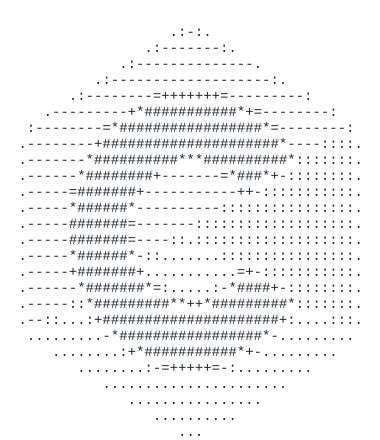

<div align="center">



# 💻 Praticando C
**Forjando a base da programação, ponteiro por ponteiro!**


</div>

---

## 🚀 O que é este repositório?

Seja bem-vindo ao meu laboratório de **C**! 🧪
Aqui é onde eu quebro a cabeça com gerenciamento de memória, estruturas de dados e a sintaxe clássica que deu origem a quase tudo que usamos hoje. 

Este espaço serve como meu **portfólio pessoal e diário de bordo**, documentando minha evolução e entendimento da lógica de programação "direto no metal".

---

## 🗺️ Mapa do Repositório

Aqui a casa é organizada! Deixei de fora os arquivos de configuração do Git para focar apenas no que importa: o código.

```text
📂 praticando-c/
│
├── 🗂️ cabecalhos/
│   ├── cabecalho.c          ← Lógica por trás das funções utilitárias
│   └── cabecalho.h          ← Contratos, structs e declarações globais
│
└── 🛠️ praticas/
    ├── cadastro_clientes.c  ← (Prática 01) Gerenciamento via Structs + Alocação Dinâmica
    └── calculadora_idade.c  ← (Prática 02) Lógica de conversão de tempo
```

---

## 🕹️ O que tem dentro das Práticas?

| Arquivo | Descrição | Destaques Técnicos |
| :--- | :--- | :--- |
| `cadastro_clientes.c` | Um sistema de registro interativo de usuários via terminal. | `structs`, `malloc`, `free`, formatação de I/O |
| `calculadora_idade.c` | Transforma idade de anos/meses/dias para total de dias vividos. | Matemática, modularização com arquivos `.h` e `.c` |

---

## ⚙️ Como rodar na sua máquina

Para compilar, você só precisa do velho e confiável **GCC**. Puxe o terminal na raiz do projeto e divirta-se:

**Para rodar o Cadastro de Clientes:**
```bash
gcc -g praticas/cadastro_clientes.c -o cadastro_clientes.exe
./cadastro_clientes.exe
```

**Para rodar a Calculadora de Idade (que exige o cabeçalho customizado):**
```bash
gcc -g praticas/calculadora_idade.c cabecalhos/cabecalho.c -o calculadora_idade.exe
./calculadora_idade.exe
```

---

<div align="center">
  <br>
  <i>"C makes it easy to shoot yourself in the foot; C++ makes it harder, but when you do it blows your whole leg off."</i><br>
  — Bjarne Stroustrup
  <br><br>
  Feito com ☕, ódio por segmentation faults e muita dedicação.
</div>
